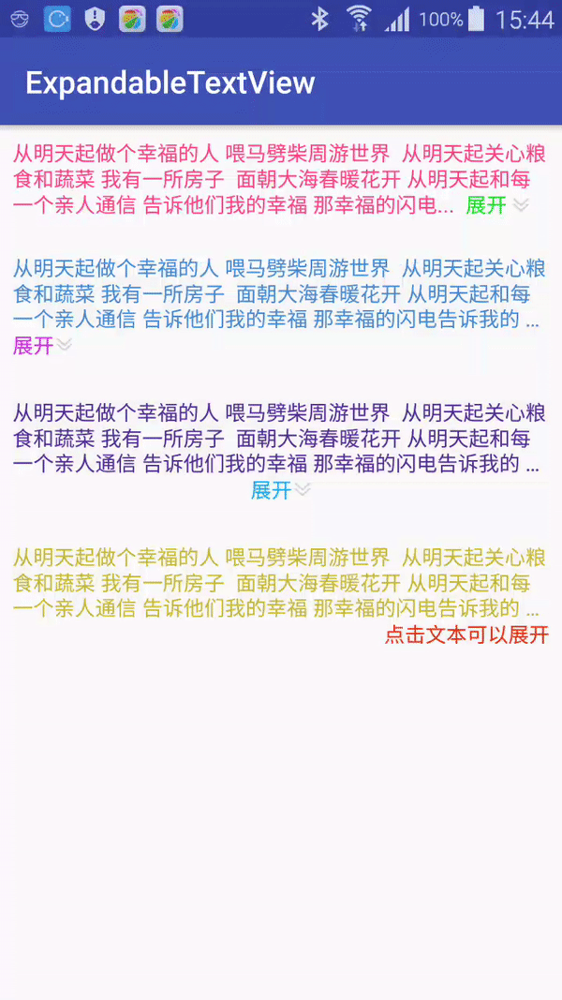

# ExpandableTextView

>一个用于Android的可以自定义的展开折叠文本控件

### Demo

见示例APP

### gradle快速集成

```
dependencies {
    ```
    implementation 'com.eric.android.view:expandable-textview:1.0.8'

    ```
}
```

### 效果图


